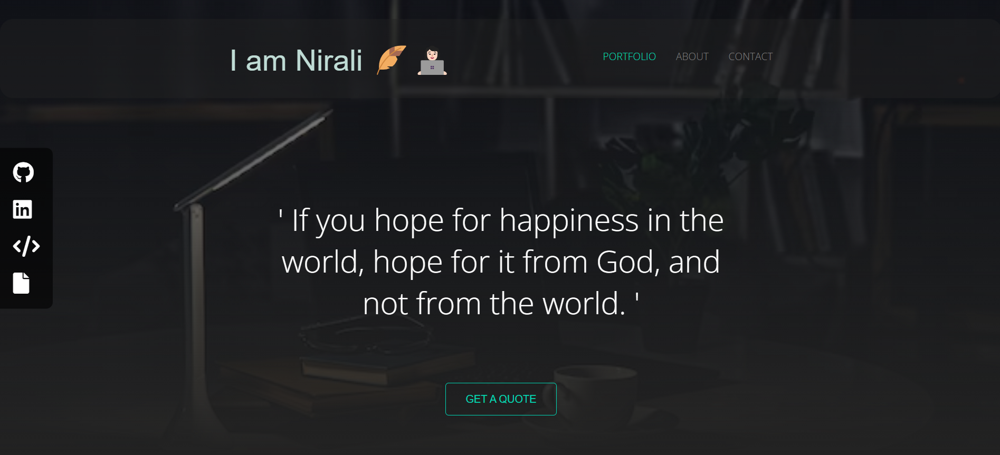
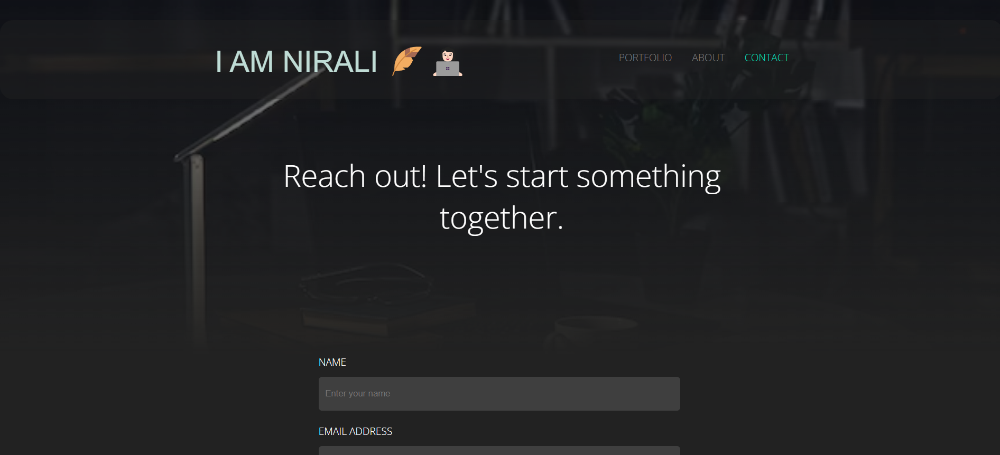
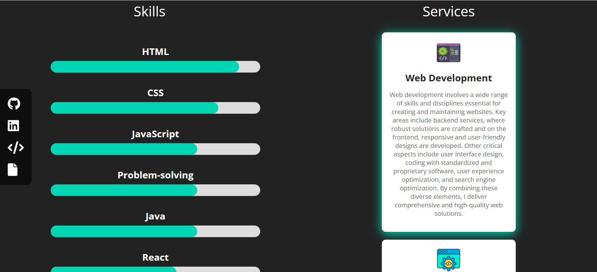

# Portfolio Website

👋 Welcome to my portfolio website! This project showcases my work and skills using HTML, CSS, and JavaScript. 

## 🌟 Features

- **Responsive Design**: The website is fully responsive and looks great on all devices.
- **Interactive Elements**: JavaScript is used to add interactivity and enhance user experience.
- **Stylish Layout**: Custom CSS provides a clean and modern design.
- **Portfolio Section**: Displays a gallery of my projects with descriptions and links.
- **Contact Form**: Allows visitors to get in touch with me directly from the website.
- **Get Quotes**: A button that displays dynamic quotes when clicked.

## 🛠️ Technologies Used

- **HTML5**: For the structure of the website.
- **CSS3**: For styling and layout.
- **JavaScript**: For interactive elements and dynamic content.

## 🚀 Getting Started

To view the portfolio website locally, follow these steps:

1. **Clone the repository**:
    ```bash
    git clone https://github.com/yourusername/portfolio.git
    ```
2. **Navigate to the project directory**:
    ```bash
    cd portfolio
    ```
3. **Open `Portfolio.html` in your browser**:
    ```bash
    open Portfolio.html
    ```

## 📸 Screenshots

### Portfolio Page




## ✨ Contributing

Contributions are welcome! If you have any suggestions or improvements, please submit a pull request or open an issue.

## 📧 Contact

Feel free to reach out to me at [darjinirali@gmail.com](mailto:darjinirali@gmail.com) or connect with me on [LinkedIn](https://www.linkedin.com/in/nirali-darji-925447292).

Thank you for visiting my portfolio website! I hope you enjoy exploring my work. 🌟

👨‍💻 [Nirali Darji]


